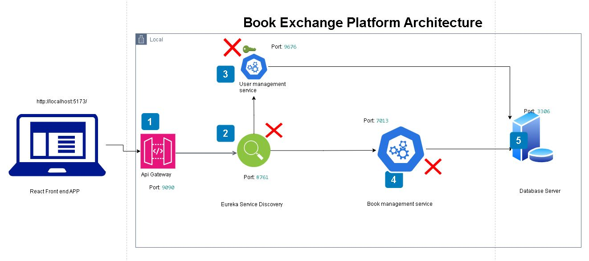

Secure API


```bash
<pre>
<repositories>
		<repository>
		    <id>jitpack.io</id>
		    <url>https://jitpack.io</url>
		</repository>
</repositories>
<dependency>
	    <groupId>com.github.prashanthsagari</groupId>
	    <artifactId>secure_api</artifactId>
	    <version>v1.0.0</version>
</dependency>
 </pre>
```
